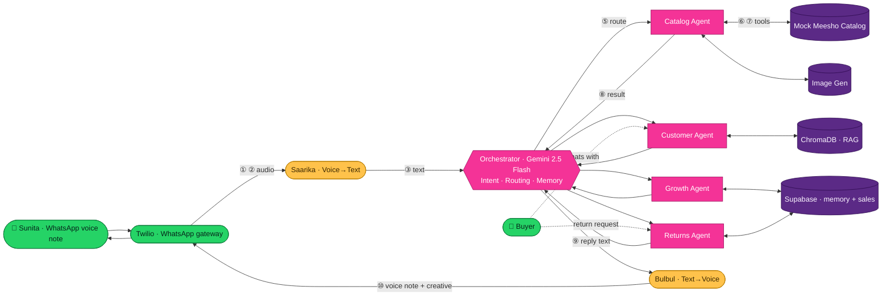

# SAKHI — ScriptedBy{Her} 2.0 · Round 2 Pitch Deck
## Complete Build Specification (Hand-off Ready for Claude Design)

> **Submission:** ScriptedBy{Her} 2.0 — Meesho's Women-Only Hackathon · Round 2 (Idea Submission)
> **Team:** Orchestrator · **Presented by:** Komal Mittal
> **Project:** Sakhi — The AI Business Didi for every Meesho reseller
> **Deck length:** 8 slides · **Format:** 16:9 · **Canvas:** 1920 × 1080 px
> **How to use this doc:** Part A is the global design system (apply to every slide). Part B is the exact slide-by-slide spec. Part C is the full architecture diagram spec for Slide 5. Part D is the asset + hand-off checklist.

---

# PART A — GLOBAL DESIGN SYSTEM
*(Applies to all 8 slides. Read this first.)*

## A1. Deck Meta
- **Aspect ratio:** 16:9, 1920 × 1080 px per slide.
- **Total slides:** 8 (no more, no less).
- **Grid:** 12-column grid. Outer margin 96 px left/right, 72 px top/bottom. Column gutter 24 px. All content lives inside this safe area.
- **Reading direction:** Left-to-right, top-to-bottom. Hero element top-left or center-left on every slide.
- **Tone of voice in copy:** Warm, confident, human, Bharat-rooted. Short sentences. No jargon unless immediately explained. Sakhi is a *friend*, not a *tool* — copy should always reflect that.

## A2. Color Palette
Apply consistently. Meesho's identity is **magenta-pink + deep purple**; the hackathon card adds **neon pink + gold**. We warm it with cream so it feels human, not cold-tech.

| Token | Hex | Use |
|---|---|---|
| **Meesho Magenta** (primary) | `#F43397` | Primary brand color, key headlines, CTA accents, Sakhi mascot dress |
| **Deep Purple** (anchor) | `#2D0A4E` | Dark slide backgrounds, footer bar, diagram backbone |
| **Royal Purple** (secondary) | `#5B2A86` | Gradient mid-tone, secondary panels |
| **Neon Pink** (highlight) | `#FF4FB7` | Glow accents, highlighted words, diagram active node |
| **Bharat Gold** (accent) | `#FFC24B` | Single-word emphasis, impact numbers, "agentic" highlight |
| **WhatsApp Green** (functional, sparing) | `#25D366` | ONLY for WhatsApp chat-bubble cues. Never as a dominant color. |
| **Cream** (light bg) | `#FFF6EF` | Light slide backgrounds, breathing room |
| **Charcoal Ink** (body text on light) | `#221A2E` | Body copy on cream |
| **Soft White** (text on dark) | `#FBF4FF` | Body copy on purple |
| **Muted Lilac** (subtle text) | `#C9B6E0` | Captions, sub-labels on dark |

**Gradient recipe (use on dark slides + title):** linear 135°, `#2D0A4E → #5B2A86 → #F43397`. Add a faint neon-pink radial glow top-right at 12% opacity.

**Rule:** Each slide is either **Light theme** (cream bg, charcoal text) or **Dark theme** (purple gradient bg, soft-white text). Alternate to create rhythm — see per-slide "Theme" tags. Never mix both backgrounds on one slide.

## A3. Typography
- **Display / Headlines:** **Poppins** — Bold (700) for H1, SemiBold (600) for H2. Warm, rounded, India-startup-friendly.
- **Body / Labels:** **Inter** — Regular (400) and Medium (500).
- **Devanagari (Hindi snippets):** **Mukta** — Medium. Used for Sakhi's quoted voice-note lines (always shown in Devanagari + a small italic English gloss beneath in Inter 13px Lilac).
- **Type scale:**
  - H1 (slide title): 56–64 px Poppins Bold
  - H2 (section head): 34–40 px Poppins SemiBold
  - H3 (card title): 22–24 px Poppins SemiBold
  - Body: 18–20 px Inter Regular, line-height 1.5
  - Caption / label: 13–15 px Inter Medium, letter-spacing +0.3
  - Big impact number: 72–96 px Poppins Bold, Bharat Gold or Neon Pink
- **Emphasis convention:** Highlight at most ONE phrase per headline — set it in Bharat Gold (on dark) or Meesho Magenta (on light). Never bold + color + underline together.

## A4. Recurring Visual Elements (must appear on every slide)
1. **Footer bar (all slides):** 48 px tall strip at very bottom. On dark slides it's `#221035` (10% darker than bg); on light slides it's a thin `#F43397` 3px rule with text above it.
   - Left of footer: small Meesho "m" logo lockup (the rounded-square magenta mark) + text "ScriptedBy{Her} 2.0".
   - Right of footer: "Team Orchestrator · Sakhi" + slide number "0X / 08".
2. **Sakhi mascot (recurring):** A small (80–110 px) friendly illustrated avatar of "Sakhi" — a warm, modern young woman with a magenta dupatta/kurti, a subtle headset or a small chat-bubble halo to signal "AI assistant." Flat-illustration style, rounded, friendly — **not** a realistic photo, **not** a generic robot. She appears bottom-right or beside her own voice-note quotes. This is a core "female presence" device — she must recur.
3. **Chat-bubble motif:** Rounded WhatsApp-style speech bubbles (16px corner radius, one squared corner toward the speaker). Sunita's bubbles = cream/grey, left-aligned. Sakhi's bubbles = magenta gradient, right-aligned. Used wherever a conversation is shown.
4. **Corner glow:** A soft neon-pink radial glow in one corner of dark slides (rotate the corner per slide for variety).

## A5. The Two Faces of the Deck (Character Bible — keep consistent)
- **Sunita** — the reseller. 34, Kanpur. Illustrated as a warm, confident woman in a simple saree, smartphone in hand. Appears on Slides 2 and 6. Same illustration style and same face throughout. She is the *human* the deck is about.
- **Sakhi** — the AI didi (the mascot in A4.2). Appears on Slides 1, 3, 4, 5, 6, 7. She is the *product*. Consistent magenta-dupatta look every time.
- **Illustration style across both:** Flat vector, rounded, warm skin tones, Meesho-palette clothing, soft shadows. Cohesive set — they should look like they belong in the same storybook.

## A6. Iconography
- Style: **Duotone line icons**, 2px stroke, rounded caps, magenta + purple duotone. Consistent weight everywhere.
- Each of the 4 agents gets a fixed icon used identically on every slide it appears:
  - **Catalog Agent** → a price-tag + sparkle icon
  - **Customer Agent** → a chat-bubble + headset icon
  - **Growth Agent** → an upward graph + voice-wave icon
  - **Returns Agent** → a return-arrow + heart icon
- **Orchestrator** → a hub/conductor node icon (central dot with 4 radiating lines).

## A7. "Female Presence + Meesho Touch" Checklist (verify on EVERY slide)
Before any slide is considered done, confirm:
- [ ] Meesho magenta is present and dominant (not just an accent).
- [ ] The Meesho "m" mark appears at least in the footer.
- [ ] A woman is visibly represented (Sunita, Sakhi mascot, or women-impact framing).
- [ ] At least one Hindi/vernacular touch is visible where natural (Sakhi's voice lines).
- [ ] Nothing reads as cold/generic-AI — warmth is preserved.

---

# PART B — SLIDE-BY-SLIDE SPECIFICATION

---

## ◼ SLIDE 1 — TITLE / HOOK
**Theme:** Dark (purple→magenta gradient) · **Scoring target:** First impression, Innovation
**Mandated section:** (Cover)

### Layout (zones)
- **Background:** Full-bleed A2 gradient. Neon-pink corner glow top-right. Faint network-dot texture at 6% opacity (echoes the hackathon card) — keep it subtle.
- **Top-left (header strip, y≈80px):** Meesho "m" mark + small text "ScriptedBy{Her} 2.0 · Round 2: Idea Submission". 14px, Muted Lilac.
- **Center-left block (the hero, occupies columns 1–7, vertically centered):**
  - Pre-title kicker (16px, Bharat Gold, letter-spaced): `MEESHO × AGENTIC AI`
  - **Project name (H1, 110px Poppins Bold, Soft White):** `Sakhi`
  - Directly under name, a 4px magenta underline rule, 180px wide.
  - **Tagline (H2, 36px Poppins SemiBold):** "The AI **Business Didi** for every Meesho reseller." — highlight "Business Didi" in Bharat Gold.
  - **One-line descriptor (20px Inter, Muted Lilac, max 2 lines):** "An agentic AI co-pilot that runs a reseller's entire business — sourcing, selling, customer chats, and growth — through WhatsApp, in her own language and her own voice."
- **Right block (columns 8–12):** The **Sakhi mascot**, large (≈520px tall), standing confidently, a soft magenta glow halo behind her, a small WhatsApp chat bubble floating near her hand reading (Devanagari, Mukta): "नमस्ते दीदी 👋" with English gloss beneath "Hello, didi 👋".
- **Footer:** Standard footer (A4.1). Left: "ScriptedBy{Her} 2.0". Right: "Team Orchestrator · Presented by Komal Mittal · 01 / 08".

### Build / motion (optional, if supported)
Name "Sakhi" fades up first; tagline second; mascot slides in from right last. Keep under 1.5s total.

### Designer notes
The whole slide must feel like a *brand reveal*, not a tech cover. Sakhi (the mascot) is the emotional anchor — give her real presence and warmth.

---

## ◼ SLIDE 2 — THE PROBLEM: MEET SUNITA
**Theme:** Light (cream bg) · **Scoring target:** High Potential Impact (problem realness)
**Mandated section:** "The problem you're solving"

### Layout (zones)
- **Title (top, H1, charcoal):** "Meet Sunita. She runs a business in **4-hour shifts** she can't escape." — highlight "4-hour shifts" in Meesho Magenta.
- **Left column (columns 1–4): the persona card.**
  - Sunita illustration (≈360px), smartphone in hand, inside a rounded magenta-bordered card.
  - Under the illustration, a tidy fact stack (Inter 16px):
    - 👩 Sunita Devi, 34 · Kanpur, UP
    - 🛍️ Meesho reseller since 2022
    - 📱 Sells sarees to 200+ WhatsApp customers
    - 💰 Earns **₹6,200 / month** (highlight the figure magenta)
- **Center-right (columns 5–12): "The hidden 4-hour tax."** A horizontal row of **4 pain chips** (rounded cards, soft shadow, duotone icon top-left of each):
  1. **Screenshot relay** — "Forwards the same product screenshots to 8 WhatsApp groups, by hand."
  2. **Repeat questions** — "Answers *'size kya hai didi?'* 40 times a day."
  3. **Manual pricing** — "Calculates margins on a calculator, sale by sale."
  4. **Chasing returns** — "Loses sales to returns she has no time to save."
- **Bottom strip (full width, dark magenta band, columns 1–12):** The zoom-out line, centered, Soft White 24px:
  "Sunita is **one of 1.7 crore Meesho resellers** — and **~80% of them are women** from Tier 2, 3 & 4 Bharat, all hitting the same ceiling." — highlight "1.7 crore" and "80% of them are women" in Bharat Gold.
- **Footer:** standard · "02 / 08".

### Designer notes
Sunita must look *dignified and capable*, not pitiable — she's a businesswoman who's under-equipped, not a victim. The 4 chips should be instantly skimmable in 5 seconds.

---

## ◼ SLIDE 3 — THE SOLUTION: INTRODUCING SAKHI
**Theme:** Dark (gradient) · **Scoring target:** Innovation & Creativity
**Mandated section:** "Your proposed solution"

### Layout (zones)
- **Title (top, H1, Soft White):** "What if Sunita had a **business partner** who never sleeps?" — highlight "business partner" Bharat Gold.
- **Sub-line (H2, 26px, Muted Lilac):** "Meet **Sakhi** — the ₹15,000/month assistant Sunita could never afford, now free, in her pocket, on WhatsApp."
- **Center-left (columns 1–6): a live phone mockup.** A realistic WhatsApp chat frame (phone bezel, status bar, chat header showing "Sakhi 💗" with a green online dot). Inside, ONE exchange in chat bubbles:
  - Sunita (left, grey bubble, voice-note style with waveform): 🎤 0:08 — caption beneath in small italic: *"Sakhi, is saree ko meri list mein daal, ₹599 rakh."*
  - Sakhi (right, magenta bubble, voice-note + a small image thumbnail of a generated saree post): 🎤 0:11 — caption beneath: *"Ho gaya didi! Post taiyaar hai, margin ₹180. Bhej dun? 💗"*
- **Center-right (columns 7–12): the four jobs.** Header (H3): "Sakhi does the four jobs Sunita has no time for:" — then a 2×2 grid of **agent cards**, each with its fixed A6 icon, title, one line:
  - **Catalog Didi** — "Turns any Meesho product into a ready-to-share post, in her language."
  - **Customer Didi** — "Answers her buyers 24×7 in vernacular, so she can rest."
  - **Growth Didi** — "Coaches her every week with a voice note: what to stock, what's trending."
  - **Returns Didi** — "Turns returns into exchanges with one friendly conversation."
- **Promise banner (bottom, full-width pill, magenta fill, Soft White, centered):** "No app to download. No English to learn. She just **talks to Sakhi like a friend.**" — highlight last clause Bharat Gold.
- **Sakhi mascot:** small, peeking bottom-right corner near the banner.
- **Footer:** standard · "03 / 08".

### Designer notes
This is the "aha" slide. The phone mockup must look real and warm. The 2×2 grid introduces the four agents by their friendly "Didi" names — these names recur on Slides 4 & 5, so lock them here.

---

## ◼ SLIDE 4 — HOW SAKHI WORKS: THE FOUR AGENTS
**Theme:** Light (cream) · **Scoring target:** Innovation + Technical Excellence
**Mandated section:** "Your approach" (conceptual half)

### Layout (zones)
- **Title (top, H1, charcoal):** "Not a chatbot. A **team of four specialist agents**, with one conductor." — highlight "team of four specialist agents" Meesho Magenta.
- **Center (the spine): the Orchestrator.** A central circular node (the A6 orchestrator/conductor icon) labeled "**Orchestrator**" with a sub-label "Reads intent · routes the task · remembers everything (Gemini 2.5 Flash)." Place it center-top, ~columns 5–8.
- **Four agent columns fanning out below the orchestrator (columns 1–3, 4–6, 7–9, 10–12):** Each is a tall rounded card connected to the Orchestrator by a thin curved magenta line (so it visually reads as "conductor → players"). Each card contains: the fixed agent icon (top), agent name (H3), a one-line "what it does", and a two-line "how" with the tool named:
  1. **Catalog Agent**
     - Does: "Product link/photo → a vernacular, ready-to-sell WhatsApp post + auto-priced listing."
     - How: "Gemini reads the product; writes a Kanpuri-Hindi caption; saves the listing."
  2. **Customer Agent**
     - Does: "Answers her buyers' questions instantly, in their language, 24×7."
     - How: "Looks up the real product details (RAG over her catalog) before replying — never guesses."
  3. **Growth Agent**
     - Does: "A weekly voice note coaching her: what sold, what's trending, what to stock next."
     - How: "Reads her week's sales + the festival calendar; speaks it back via Indic voice."
  4. **Returns Agent**
     - Does: "Has a kind conversation with the buyer to convert a return into an exchange."
     - How: "Detects the real reason, offers an exchange, and teaches the Catalog Agent for next time."
- **Bottom caption strip (full width, dark band):** "Four specialists. One orchestrator. **Long-term memory per reseller.** This is **agentic AI** — coordinated, not a single prompt." — highlight "agentic AI" Bharat Gold.
- **Footer:** standard · "04 / 08".

### Designer notes
The visual hierarchy must scream "orchestration": one node at top, four players below, connected. This single image is what judges screenshot. Keep the agent icons identical to Slide 3 so the viewer recognizes them.

---

## ◼ SLIDE 5 — ARCHITECTURE & WORKFLOW (THE FULL SYSTEM)
**Theme:** Dark (gradient, but slightly desaturated so the diagram pops) · **Scoring target:** Technical Excellence + Feasibility
**Mandated section:** "Your approach and implementation strategy" (technical half)
**This is the new slide you requested — the proper architecture/workflow diagram. Full spec in PART C; this section covers the slide framing.**

### Layout (zones)
- **Title (top-left, H2 — smaller than usual to give the diagram room, Soft White):** "How one voice note travels through Sakhi — in **5 seconds**." — highlight "5 seconds" Bharat Gold.
- **Sub-line (16px, Muted Lilac):** "End-to-end agentic workflow · request → orchestration → action → reply."
- **Main canvas (≈85% of the slide): the architecture diagram** built exactly to PART C. Render it as a clean left-to-right flow with a return loop. Use the deck palette (magenta nodes, purple backbone, gold for the active path, green only at the WhatsApp endpoints).
- **A subtle numbered path (①→⑩)** overlaid on the diagram edges so a presenter can narrate the journey step-by-step.
- **Bottom-right inset (small):** a "legend" key — node-color meaning: magenta = agent, purple = infra/data, gold = Vaani voice layer, green = WhatsApp endpoints.
- **Footer:** standard · "05 / 08".

### Designer notes
Do **not** clutter. The diagram is the slide. Keep labels short (the PART C spec gives exact labels). The numbered path is what turns a static diagram into a "workflow." See PART C for node coordinates, edges, labels, and a reference diagram.

---

## ◼ SLIDE 6 — A DAY WITH SAKHI: IMPLEMENTATION & TECH STACK
**Theme:** Light (cream) · **Scoring target:** Feasibility & Scalability + Technical Excellence
**Mandated section:** "Implementation strategy"

### Layout (zones)
- **Title (top, H1, charcoal):** "**A day in Sunita's life** — now with Sakhi." — highlight "A day in Sunita's life" Meesho Magenta.
- **Center band (the hero): a horizontal 4-panel timeline.** Each panel is a rounded card with a time-stamp pill (magenta) at top, a small scene illustration, and a 1-line story. Connect the 4 panels with a thin magenta timeline arrow:
  1. **9:00 AM — List** — "Sunita voice-notes a Meesho saree link. *Catalog Agent* returns a Hindi post + a ₹180 margin. She forwards it. ☕ Done in 20 seconds."
  2. **2:00 PM — Sell** — "A buyer asks *'free size hai?'* while Sunita naps. *Customer Agent* replies instantly in Hindi and closes the sale."
  3. **Sun 8:00 PM — Grow** — "*Growth Agent* sends a voice note: *'Didi, Karwa Chauth aa raha hai — red sarees ka stock badhao.'*" (small Sakhi mascot beside this panel)
  4. **Next day — Save** — "A return request comes in. *Returns Agent* offers an exchange — the sale is saved, not lost."
- **Lower third (full-width dark ribbon): the tech stack.** Header (small, Soft White): "Built end-to-end on free, India-first tools:" Then a single horizontal row of labeled logo-chips, each a rounded pill with the tool name + its role beneath in 12px:
  - **Twilio WhatsApp** (interface) · **Sarvam Saarika** (voice→text) · **Sarvam Bulbul** (text→voice) · **Gemini 2.5 Flash** (the brain) · **LangGraph** (orchestration) · **ChromaDB** (catalog memory/RAG) · **Supabase** (database)
  - Closing line under the row, centered, Bharat Gold: "**₹0 infrastructure cost at prototype scale.** Redundant free-tier fallbacks at every layer."
- **Footer:** standard · "06 / 08".

### Designer notes
This slide does double duty: the timeline proves the *product experience*; the ribbon proves *technical feasibility*. Keep the timeline warm and illustrated; keep the tech ribbon clean and credible. The Karwa-Chauth line is a deliberate Meesho/Bharat cultural touch — keep it.

---

## ◼ SLIDE 7 — THE IMPACT: HER · MEESHO · BHARAT
**Theme:** Dark (gradient, richest of the deck) · **Scoring target:** High Potential Impact
**Mandated section:** "The impact your solution can create"

### Layout (zones)
- **Title (top, H1, Soft White):** "One co-pilot. **Three circles of impact.**" — highlight "Three circles of impact" Bharat Gold.
- **Three equal columns (1–4 / 5–8 / 9–12), each a tall rounded panel with a heading band on top:**
  1. **FOR HER (the reseller)** — heading band magenta. A small woman icon.
     - **Big stat:** "₹6,200 → **₹11,000+** / month" (the second figure in 72px Bharat Gold)
     - Bullets: "4 hours/day given back" · "No English, no literacy barrier" · "From survival to growth"
  2. **FOR MEESHO (the platform)** — heading band purple. Meesho "m" icon.
     - **Big stat:** "Higher reseller **retention**" (retention in gold)
     - Bullets: "Retention = Meesho's #1 GMV lever" · "Projected 5–8% relative drop in returns" · "Unlocks deeper Tier 3/4 where the assistant-economy doesn't exist"
  3. **FOR BHARAT (the mission)** — heading band gradient. A map-of-India-with-heart icon.
     - **Big stat:** "**₹8,000+ Cr / year**" (96px Neon Pink)
     - Supporting line beneath: "At just **10% adoption (≈17 lakh resellers)** × ₹4,000/month average income uplift — additional annual income flowing to **women-led households**."
- **Bottom strip (full width, magenta band): the philanthropic hook.** "💗 **The Bharat Shelf:** Sakhi can promote Self-Help-Group-made products on every reseller's catalog at **zero commission** — turning each woman's store into a doorway for other women's livelihoods." — highlight "Bharat Shelf" and "zero commission" Bharat Gold.
- **Footer:** standard · "07 / 08".

### Designer notes
Make the three big stats the loudest thing on the slide — they're the lines judges quote when deliberating. The ₹8,000 Cr figure must be visually the hero. The Bharat Shelf strip is what cements the philanthropic + women-empowerment narrative; keep the heart emoji and warm tone.

> **Math transparency note (keep this defensible if asked):** 17,00,000 resellers × ₹4,000/month × 12 months ≈ ₹8,160 Cr/year. Frame as a conservative 10%-adoption projection, not a guarantee.

---

## ◼ SLIDE 8 — WHY THIS WILL WORK: FEASIBILITY & WHY NOW
**Theme:** Light (cream) · **Scoring target:** Feasibility & Scalability (close strong)
**Mandated section:** Feasibility / closing conviction

### Layout (zones)
- **Title (top, H1, charcoal):** "**Why now — and why this is buildable.**" — highlight "Why now" Meesho Magenta.
- **Left half (columns 1–6): "WHY NOW."** A vertical list of 4 timing cards, each with a duotone icon + one tight line:
  1. 🗣️ "**Indic LLMs crossed production quality** in 2025 (Sarvam, IndicTrans2) — vernacular voice finally works."
  2. 💬 "**WhatsApp Business API is free** at our scale — zero on-ramp friction for Bharat."
  3. 📈 "**Meesho's reseller base hit critical mass** — the assistant-economy gap is acute *right now*."
  4. 🎙️ "**Voice-first finally serves low-literacy users** — the last barrier just fell."
- **Right half (columns 7–12): "WHY FEASIBLE."** A compact 3-week roadmap shown as a simple horizontal bar split in 3, plus 3 reassurance bullets beneath:
  - **Roadmap bar:**
    - Week 1 — "Plumbing: WhatsApp + voice + orchestrator skeleton"
    - Week 2 — "Two core agents (Catalog + Customer), end-to-end"
    - Week 3 — "Growth + Returns agents, dashboard, demo polish"
  - **Reassurance bullets (Inter 16px):**
    - "✅ All tools free-tier, with a fallback at every layer (Twilio flakes → Streamlit web mirror)."
    - "✅ Solo-buildable: 80% of the AI is handled by Sarvam + Gemini + LangGraph — we orchestrate, not reinvent."
    - "✅ Mock Meesho catalog of ~500 SKUs stands in for the (private) catalog API — transparently declared."
- **Closing banner (bottom, full-width gradient pill, Soft White, centered, 28px):** "Sakhi is being built **by a woman, for 1.7 crore women.** With Meesho's scale, she becomes **every Bharat reseller's didi.** Take us to Round 3 — we'll bring the working prototype." — highlight "by a woman, for 1.7 crore women" Bharat Gold.
- **Sakhi mascot:** waving, bottom-right corner of the banner.
- **Footer:** standard · "08 / 08".

### Designer notes
This slide must close on *conviction + execution credibility*. The two-column "why now / why feasible" structure pre-empts the judges' biggest doubts. The closing banner is the emotional mic-drop — give it weight. Because the submission is under Komal's name, the closing line stays product- and mission-focused ("by a woman, for women"), with no individual credentials needed.

---

# PART C — THE ARCHITECTURE / WORKFLOW DIAGRAM (for Slide 5)
*Build this exactly. It is the technical centerpiece of the deck.*

## C1. Diagram concept
A **left-to-right horizontal flow** showing a single voice note's complete journey, with a **return loop** back to the user. Three visual "lanes" stacked conceptually but drawn as one connected flow:
- **Voice layer (Vaani)** — gold-tinted nodes (the ears & mouth).
- **Intelligence layer** — magenta nodes (orchestrator + agents).
- **Data/Infra layer** — purple nodes (memory, catalog, tools).
- **Endpoints** — green (WhatsApp / the people).

## C2. Nodes (exact labels + color + position)
Lay out on a 1920-wide canvas in 5 vertical bands (left→right). Coordinates are approximate centers.

| # | Node label | Sub-label | Color | Band (x) | Row (y) |
|---|---|---|---|---|---|
| A | **Sunita** (👩 reseller) | "Voice note in Hindi, on WhatsApp" | Green endpoint | 1 (x≈140) | mid (y≈460) |
| B | **Twilio** | "WhatsApp gateway" | Green | 1 (x≈300) | mid (y≈540) |
| C | **Saarika (ASR)** | "Voice → Text · Vaani layer" | Gold | 2 (x≈560) | mid (y≈460) |
| D | **Orchestrator** | "Intent + Routing + Memory · Gemini 2.5 Flash" | Magenta (largest node) | 3 (x≈900) | mid (y≈460) |
| E1 | **Catalog Agent** | price-tag icon | Magenta | 4 (x≈1240) | row 1 (y≈220) |
| E2 | **Customer Agent** | chat+headset icon | Magenta | 4 (x≈1240) | row 2 (y≈400) |
| E3 | **Growth Agent** | graph+wave icon | Magenta | 4 (x≈1240) | row 3 (y≈580) |
| E4 | **Returns Agent** | return+heart icon | Magenta | 4 (x≈1240) | row 4 (y≈760) |
| F1 | **Mock Meesho Catalog** | "~500 SKUs (JSON)" | Purple | 5 (x≈1560) | row 1 (y≈220) |
| F2 | **ChromaDB** | "RAG / product lookup" | Purple | 5 (x≈1560) | row 2 (y≈400) |
| F3 | **Supabase** | "Reseller memory + sales" | Purple | 5 (x≈1560) | row 3 (y≈580) |
| F4 | **Image Gen** | "Creatives (Gemini/Imagen)" | Purple | 5 (x≈1560) | row 4 (y≈760) |
| G | **Bulbul (TTS)** | "Text → Voice · Vaani layer" | Gold | 2 (x≈560) | lower (y≈760) |

## C3. Edges (the numbered workflow path ①–⑩)
Draw directional arrows; overlay small numbered circles on the forward path so it reads as a story:
- ① **A → B** : "Sunita sends a voice note."
- ② **B → C** : "Twilio passes audio to the voice layer."
- ③ **C → D** : "Saarika transcribes Hindi → text."
- ④ **D** (self-loop badge) : "Orchestrator detects intent, loads memory, picks an agent."
- ⑤ **D → E(x)** : "Routes to the right specialist (e.g., Catalog Agent)."
- ⑥ **E(x) → F(y)** : "Agent uses its tools — fetch product, look up details, save listing, generate creative."
- ⑦ **F(y) → E(x)** : "Tools return data to the agent." (draw as a paired double-arrow with ⑥)
- ⑧ **E(x) → D** : "Agent hands the result back to the Orchestrator."
- ⑨ **D → G** : "Orchestrator drafts the reply; Bulbul converts text → Hindi voice."
- ⑩ **G → B → A** : "WhatsApp delivers the voice note + creative back to Sunita." (route the return arrow cleanly along the bottom back to Sunita)
- **Side actor (optional, draw faintly):** a **Customer (👤)** node near the bottom connected to **E2 Customer Agent** and **E4 Returns Agent**, labeled "Buyers chat directly with Sakhi on Sunita's behalf." Keep it visually secondary (lower opacity) so it doesn't compete with the main loop.

## C4. Visual styling of the diagram
- Active forward path (①→⑩): draw in **Bharat Gold** glowing line, 3px. Tool round-trips (⑥/⑦): magenta-purple thinner lines.
- Nodes: rounded rectangles, 16px radius, soft drop shadow, label in Poppins SemiBold 18px, sub-label Inter 13px Muted Lilac.
- The **Orchestrator (D)** is visually the largest node with a subtle pulsing glow ring — it's the star.
- Keep whitespace generous; never let arrows cross nodes. If row 4 (Returns/ImageGen/Customer) feels crowded, lower its opacity slightly — it's supporting cast.

## C5. Reference diagram (Mermaid — for the designer to mirror layout/logic)
> Use this only as a **logic/layout reference**. The final slide diagram must be redrawn in the deck's visual style (palette, rounded nodes, gold path, numbered circles) — not pasted as raw Mermaid output.

---

# PART D — ASSET CHECKLIST & HAND-OFF NOTES

## D1. Illustrations to create (consistent flat-vector set)
1. **Sakhi mascot** — full body (Slide 1, large), + small waving/peeking variants (Slides 3, 4, 5, 7, 8). One consistent design.
2. **Sunita** — persona illustration with smartphone (Slide 2), + 4 mini scene variants for the day-timeline (Slide 6: listing at a table, napping, listening to a voice note, handling a return).
3. **4 agent icons** (duotone, fixed) — reused identically on Slides 3, 4, 5.
4. **Orchestrator hub icon** — Slides 4, 5.
5. **3 impact icons** — woman / Meesho-m / India-heart (Slide 7).
6. **Tool logo-chips** — Twilio, Sarvam (Saarika & Bulbul), Gemini, LangGraph, ChromaDB, Supabase (Slide 6). Use clean text-pills if official logos aren't licensable.

## D2. Copy bank for Sakhi's Hindi voice lines (Devanagari + gloss — use as-is)
- "नमस्ते दीदी 👋" — *Hello, didi 👋*
- "Sakhi, is saree ko meri list mein daal, ₹599 rakh." — *Sakhi, add this saree to my list, set ₹599.*
- "Ho gaya didi! Post taiyaar hai, margin ₹180. Bhej dun? 💗" — *Done, didi! The post is ready, margin ₹180. Shall I send it? 💗*
- "Didi, Karwa Chauth aa raha hai — red sarees ka stock badhao." — *Didi, Karwa Chauth is coming — increase red saree stock.*
> (Render Hindi lines in Mukta; glosses in Inter italic 13px, Muted Lilac.)

## D3. Slide theme rhythm (so the deck breathes)
1 Dark · 2 Light · 3 Dark · 4 Light · 5 Dark · 6 Light · 7 Dark · 8 Light. (Alternating — already baked into each slide's "Theme" tag above. Keep this rhythm.)

## D4. Final pre-flight checklist
- [ ] Exactly 8 slides, 16:9.
- [ ] Meesho magenta dominant on every slide; "m" mark in every footer.
- [ ] A woman is visibly present on every slide (Sunita, Sakhi, or women-impact framing).
- [ ] Agent icons identical across Slides 3/4/5.
- [ ] The four agent "Didi" names consistent (Catalog/Customer/Growth/Returns) everywhere.
- [ ] Slide 5 architecture diagram redrawn in deck style with the ①–⑩ numbered path and legend.
- [ ] Every Hindi line has its English gloss.
- [ ] Submission credit reads "Team Orchestrator · Komal Mittal" on cover + footers.
- [ ] No slide mixes light + dark backgrounds.
- [ ] Impact numbers (₹11,000+, ₹8,000+ Cr) are the loudest elements on Slide 7.

## D5. The four mandated email sections → slide mapping (for the judges' checklist)
- **Problem you're solving** → Slide 2.
- **Proposed solution** → Slides 3 + 4.
- **Approach & implementation strategy** → Slides 5 + 6.
- **Impact your solution can create** → Slide 7 (+ feasibility close on 8).

## D6. Evaluation-criteria → slide mapping (so every criterion is hit)
- **Innovation & Creativity** → Slides 3, 4 (agentic team + voice-first didi).
- **High Potential Impact** → Slides 2, 7.
- **Feasibility & Scalability** → Slides 6, 8.
- **Technical Excellence** → Slides 4, 5, 6.
- **Working Prototype** → seeded by Slide 5 (real architecture) + Slide 8 (3-week build plan); delivered in Round 3.

---

*End of specification. This document is self-contained — hand it to Claude Design as-is to generate the full 8-slide deck.*
